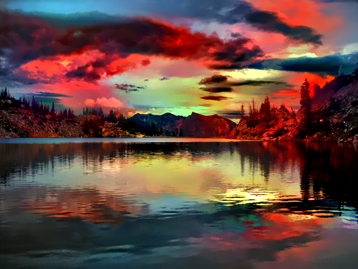
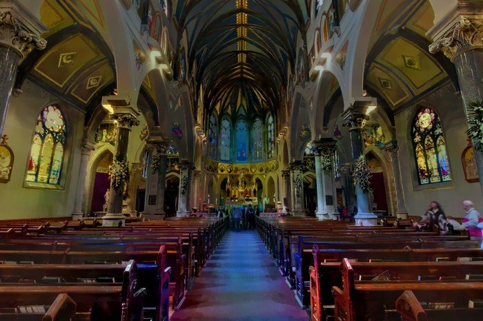
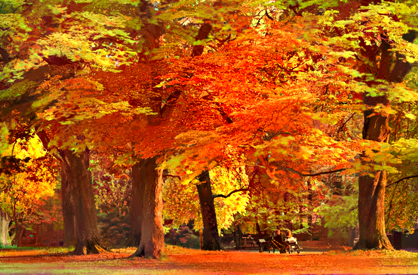
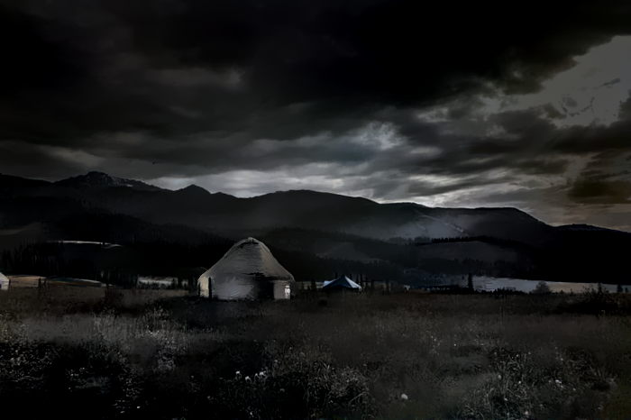
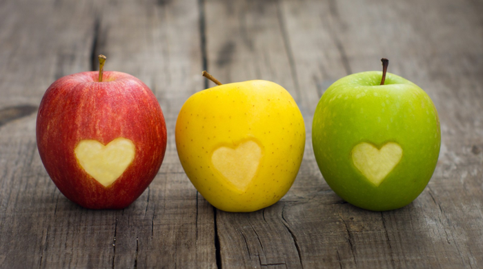
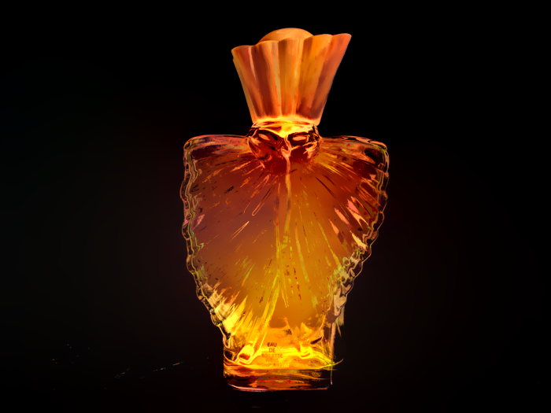
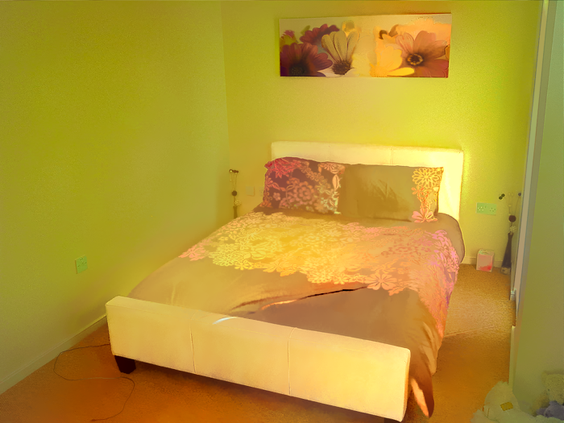
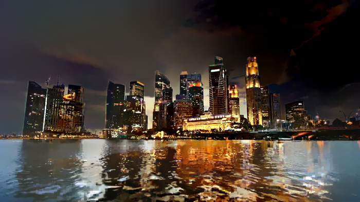

# deep-photo-styletransfer
Code for paper "Deep Photo Style Transfer": [arXiv link coming soon]


## Setup
This code is based on torch. It has been tested on Ubuntu 14.04 LTS. 

Dependencies:
* [Torch](https://github.com/torch/torch7) (with [matio-ffi](https://github.com/soumith/matio-ffi.torch) and [loadcaffe](https://github.com/szagoruyko/loadcaffe))
* [Matlab](https://www.mathworks.com/)

CUDA backend:
* [CUDA](https://developer.nvidia.com/cuda-downloads)
* [cudnn](https://developer.nvidia.com/cudnn)

Download VGG-19:
```
sh models/download_models.sh
```

Compile ``cuda_utils.cu``
```
make clean && make
```

## Usage
### Quick start
To generate all results (in ``/examples``) using the provided scripts, simply run 
```
run('gen_laplacian/gen_laplacian.m')
```
in Matlab and then
```
python gen_all.py
```
in Python. The final output will be in ``/examples/final_results``.

### Basic usage
1. Given input and style images with semantic segmentation masks, put them in ``/examples`` respectively. They will have the filenames like: ``/examples/input/in<id>.png``, ``/examples/style/tar<id>.png`` and ``/examples/segmentation/in<id>.png``, ``/examples/segmentation/tar<id>.png``;
2. Compute the matting Laplacian matrix ``matrix<id>.mat`` using ``gen_laplacian/gen_laplacian.m`` in Matlab;
3. Run the following script to generate segmented intermediate result:
```
th neuralstyle_seg.lua -content_image <input> -style_image <style> -content_seg <inputMask> -style_seg <styleMask> -index <id> -serial <intermediate_folder>
```
4. Run the following script to generate final result:
```
th deepmatting_seg.lua -content_image <input> -style_image <style> -content_seg <inputMask> -style_seg <styleMask> -index <id> -init_image <intermediate_folder/out<id>_t_1000.png> -serial <final_folder> -f_radius 15 -f_edge 0.01
```

Note: In the main paper we generate all comparison results using automatic scene segmenation algorithm modified from [DilatedNet](https://arxiv.org/abs/1606.00915). Manual segmentation enables more diverse tasks and hence we provide the masks in ``/examples/segmentation``.

## Examples
Here are some results from our algorithm (from left to right are input, style and our output):
<p align='center'>
  
  
  
</p>

<p align='center'>
  
  
  
</p>

<p align='center'>
  
  
  
</p>

<p align='center'>
  
  
  
</p>

<p align='center'>
  
  
  
</p>

<p align='center'>
  
  
  
</p>

<p align='center'>
  
  
  
</p>

<p align='center'>
  
  
  
</p>

<p align='center'>
  
  
  
</p>

<p align='center'>
  
  
  
</p>

<p align='center'>
  
  
  
</p>

<p align='center'>
  
  
  
</p>

<p align='center'>
  
  
  
</p>

<p align='center'>
  
  
  
</p>

<p align='center'>
  
  
  
</p>

<p align='center'>
  
  
  
</p>


## Acknowledgement
Our torch implementation is based on Justin Johnson's [code](https://github.com/jcjohnson/neural-style).

## Contact
Feel free to contact me if there is any question (Fujun Luan fl356@cornell.edu).  


